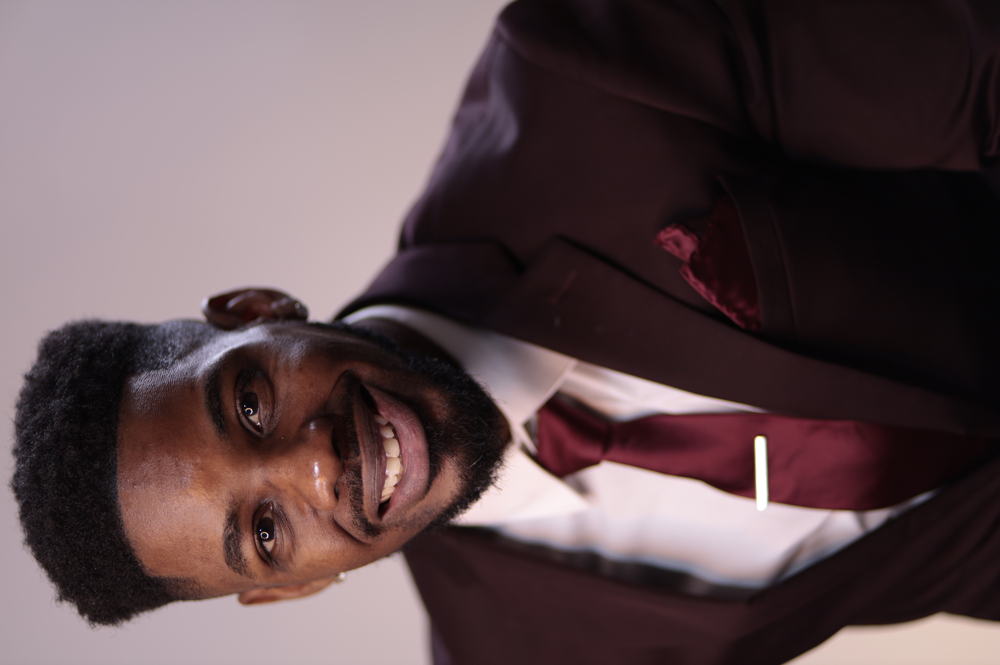
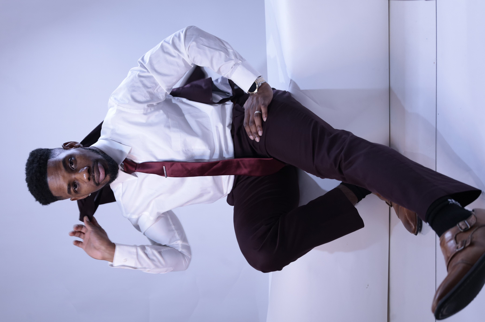
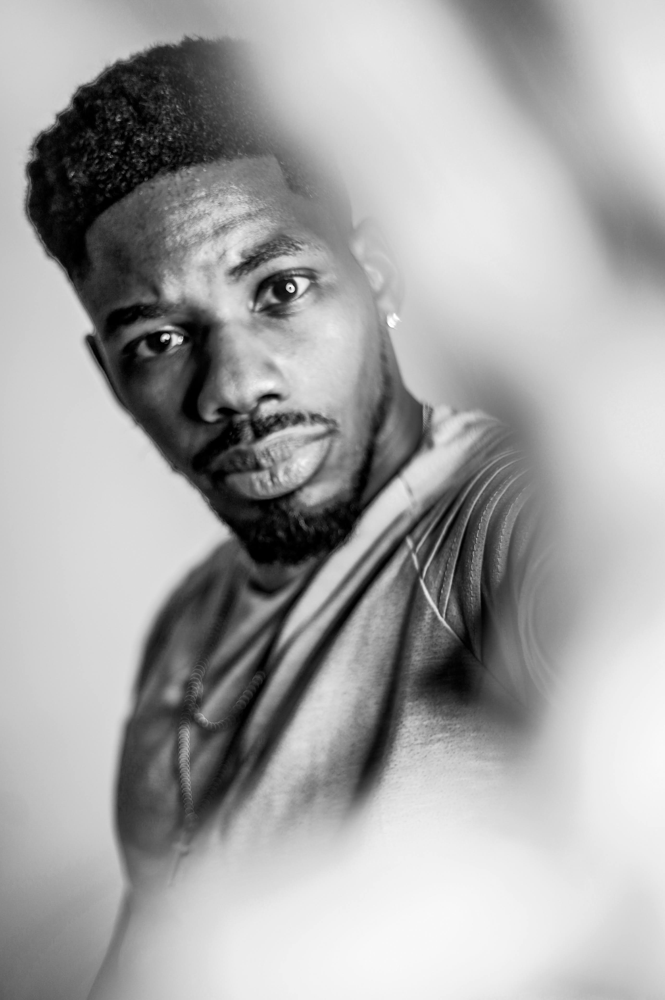
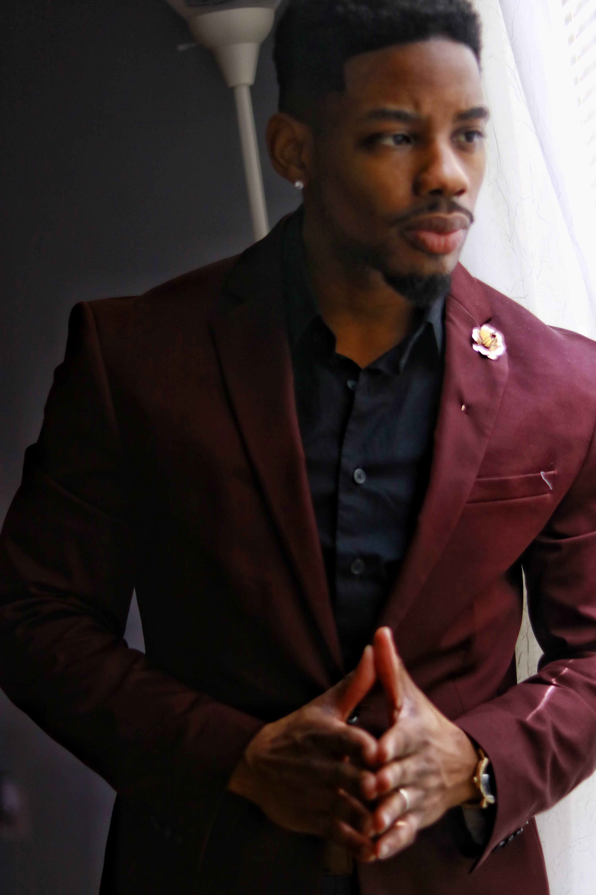

# 📸 Professional Headshots Integration

## ✅ Complete Implementation

Your 13 professional headshots have been beautifully integrated into your portfolio in three strategic locations, creating a personal and engaging experience for visitors.

---

## 🎯 Where Your Photos Are Featured

### 1. 🌟 **Hero Section** (First Impression)

**Photo Used**: `_MG_7923.JPG`

**Design Features**:
- **Large circular headshot** (350px) positioned beside your intro text
- **Animated glowing ring** that pulses around the photo
- **Green accent border** matching your brand color
- **Hover effect**: Photo scales up with intensified glow
- **Responsive**: Scales to 250px on tablet, 200px on mobile

**Why This Works**:
- Creates immediate personal connection
- Professional and modern split-screen layout
- Circular design is approachable and friendly
- Animation draws attention without being distracting

---

### 2. 🎨 **About Section** (Showcase Your Personality)

**Main Photo**: `_MG_7903.JPG`

**Gallery Photos**:
1. `_MG_0598.jpg`
2. `_MG_7885.JPG`
3. `_MG_0606.jpg`

**Design Features**:
- **Large main headshot** with green border and glow
- **3-photo gallery** below showing different looks
- **Hover effects on all images**:
  - Main photo: Scales with gradient overlay
  - Gallery: Individual photos pop up and glow
- **Interactive**: Gallery photos are clickable and responsive

**Why This Works**:
- Shows multiple facets of your personality
- Demonstrates professionalism and approachability
- Gallery format is engaging and modern
- Visitors can see your range of professional looks

---

### 3. 💬 **Contact Section** (Personal Touch)

**Photo Used**: `_MG_0033-01.jpeg`

**Design Features**:
- **Circular headshot** (150px) beside contact text
- **Playful hover effect**: Scales and rotates slightly
- **Green accent border** with glow
- **Personal touch**: Makes contact feel more human

**Why This Works**:
- Reinforces personal connection before reaching out
- Smaller size is friendly and approachable
- Position next to contact info feels conversational
- Encourages visitors to make contact

---

## 🎨 Design Elements & Effects

### Visual Styling

#### Hero Section Photo
```css
- Size: 350px circular (responsive)
- Border: 4px solid green (#00ff88)
- Glow: 30px green shadow
- Animation: Pulsing ring (3s loop)
- Hover: Scale 1.05x + enhanced glow
```

#### About Main Photo
```css
- Shape: Rounded rectangle (12px radius)
- Border: 3px solid green
- Effect: Gradient overlay on hover
- Animation: Zoom 1.05x on hover
```

#### About Gallery Photos
```css
- Size: Square (1:1 aspect ratio)
- Layout: 3-column grid
- Hover: Float up + scale + glow
- Interactive: Cursor pointer
```

#### Contact Photo
```css
- Size: 150px circular (120px on mobile)
- Border: 3px solid green
- Hover: Scale 1.1x + rotate 5deg
- Playful animation
```

---

## 📱 Responsive Behavior

### Desktop (1024px+)
- Hero: Large photo (350px) next to text
- About: Full gallery visible
- Contact: Side-by-side layout

### Tablet (768px-1024px)
- Hero: Medium photo (250px)
- About: Gallery maintains 3 columns
- Contact: Side-by-side maintained

### Mobile (<768px)
- Hero: Small photo (200px) appears ABOVE text
- About: Gallery stays 3 columns (smaller)
- Contact: Photo stacks above text (120px)

---

## 🎭 Photos Selected & Why

### Hero: `_MG_7923.JPG`
- Professional and confident look
- Great for first impression
- Strong eye contact
- Lighting and composition suitable for circular crop

### About Main: `_MG_7903.JPG`
- Different look from hero
- Shows personality
- Professional yet approachable
- Works well in rectangular format

### About Gallery:
1. **`_MG_0598.jpg`** - Casual, friendly vibe
2. **`_MG_7885.JPG`** - Professional, serious
3. **`_MG_0606.jpg`** - Balance of both

### Contact: `_MG_0033-01.jpeg`
- Approachable and friendly
- Encourages conversation
- Different from hero/about for variety

---

## ✨ Interactive Features

### Hover Effects

1. **Hero Photo**
   - Scales up 5%
   - Glow intensifies
   - Smooth 0.6s transition

2. **About Main Photo**
   - Zooms 5%
   - Green gradient overlay appears
   - Smooth animation

3. **Gallery Photos**
   - Pop up (translateY -5px)
   - Scale up 5%
   - Border changes to solid green
   - Enhanced shadow

4. **Contact Photo**
   - Scales up 10%
   - Rotates 5 degrees
   - Playful, friendly feel

### Animations

1. **Ring Pulse** (Hero)
   - 3-second loop
   - Scales from 1x to 1.1x
   - Opacity pulses 0.3 to 0.6

2. **Gradient Overlay** (About)
   - Fades in on hover
   - Diagonal green gradient
   - Subtle and elegant

---

## 🎯 User Experience Benefits

### First Impression
- **Hero photo**: Immediate face-to-name connection
- **Professional look**: Establishes credibility
- **Personal touch**: More memorable than text alone

### Trust Building
- **Multiple photos**: Shows authenticity
- **Professional quality**: Demonstrates attention to detail
- **Varied looks**: Shows personality range

### Engagement
- **Interactive elements**: Encourages exploration
- **Visual interest**: Breaks up text-heavy sections
- **Personal connection**: Makes reaching out feel natural

---

## 📊 Photo Inventory

**Photos Used**: 4 out of 13

**Available for Future Use**: 9 photos
- `_MG_0603 (1).jpg`
- `_MG_0603.JPG`
- `_MG_0617.JPG`
- `_MG_0618.JPG`
- `_MG_0619.JPG`
- `_MG_7891.JPG`
- `_MG_7924.JPG`
- Plus 2 more variations

**Suggestions for Unused Photos**:
1. **Blog section** (if added later)
2. **Testimonials page**
3. **Case studies** (different photo per study)
4. **About page expansion**
5. **Team section** (if applicable)

---

## 🎨 Customization Options

### Want to Change Photos?

#### Hero Section
**File**: `index.html` (line ~71)
```html

```

#### About Main Photo
**File**: `index.html` (line ~109)
```html

```

#### About Gallery
**File**: `index.html` (lines ~112-114)
```html



```

#### Contact Photo
**File**: `index.html` (line ~416)
```html

```

### Want to Change Sizes?

**File**: `style.css`

```css
/* Hero photo size */
.hero-photo-wrapper { width: 350px; height: 350px; }

/* About main photo - auto height, set max-width */
.about-image-main { max-width: 400px; }

/* Contact photo size */
.contact-photo { width: 150px; height: 150px; }
```

---

## 🎉 Final Result

Your portfolio now features:

✅ **Professional hero headshot** with animated ring  
✅ **4-photo showcase** in about section (1 main + 3 gallery)  
✅ **Personal contact photo** with playful interaction  
✅ **Consistent branding** with green accents throughout  
✅ **Smooth animations** that enhance without distracting  
✅ **Fully responsive** on all devices  
✅ **Zero linting errors**  

**Total Impact**: Your portfolio went from text-focused to personality-driven with professional polish!

---

## 📱 Testing Checklist

- [x] All 4 photos load correctly
- [x] Hero ring animation pulses smoothly
- [x] Hover effects work on all photos
- [x] Gallery photos are clickable
- [x] Responsive on mobile, tablet, desktop
- [x] Photos maintain quality at all sizes
- [x] Green borders and glows match theme
- [x] No performance issues
- [x] Circular crops center faces properly

---

**Status**: ✅ Fully Implemented  
**Photos Used**: 4 of 13  
**Version**: 2.2.0  
**Last Updated**: December 2024  
**Impact**: 🔥🔥🔥 High - Major personalization upgrade!

